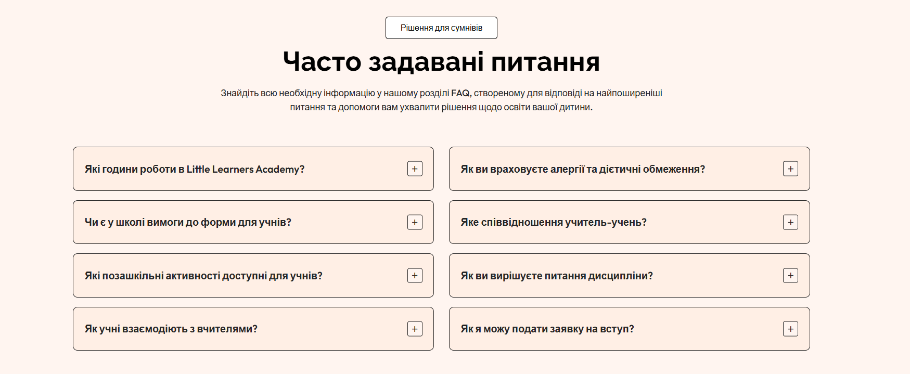

<p align="center"><h1 align="center">LittleLearners</h1></p>
<p align="center">
	<em><code>❯ A modern, responsive school website built with Flask, HTML, SCSS, and JavaScript to enhance communication and accessibility in the educational environment.</code></em>
</p>
<p align="center">
	
	
	
	
</p>
<p align="center">Built with the tools and technologies:</p>
<p align="center">
	
	
	
	
	
	
	
</p>
<br>

## 🔗 Table of Contents

- [📍 Overview](#-overview)
- [👾 Features](#-features)
- [📁 Project Structure](#-project-structure)
  - [📂 Project Index](#-project-index)
- [🎗 License](#-license)
- [📸 Screenshots](#-screenshots)
  
## 📍 Overview

LittleLearners is a responsive and interactive web application for a modern educational institution.
It provides students, teachers, and parents with access to school information, admission details, events, and contact tools.
The project combines frontend technologies (HTML, SCSS, JavaScript) with a Flask backend, offering clean design, dynamic content rendering, and real-time interaction.


## 👾 Features

🌐 Fully responsive layout for desktop and mobile devices

🧩 Modular architecture using Flask and Jinja templates

🎨 Modern, minimalistic user interface

⚙️ Dynamic data rendering from JSON sources

📨 Functional contact form connected to the backend

📚 Pages for academics, admissions, and student life

🧠 Intuitive navigation and accessible UX design


## 📁 Project Structure

```sh
└── LittleLearners/
    ├── LICENSE
    ├── README.md
    ├── app.py
    ├── static
    │   ├── images
    │   ├── scripts
    │   └── styles
    └── templates
        ├── 404.html
        ├── about.html
        ├── academics.html
        ├── admission.html
        ├── base.html
        ├── contact.html
        ├── home.html
        └── student-life.html
```


### 📂 Project Index
<details open>
	<summary><b><code>LITTLELEARNERS</code></b></summary>
	<details> <!-- __root__ Submodule -->
		<summary><b>/</b></summary>
		<blockquote>
			<table>
			<tr>
				<td><b><a href='https://github.com/AnatoliiUtochkin/LittleLearners/blob/master/app.py'>app.py</a></b></td>
				<td><code>❯ Main Flask application file</code></td>
			</tr>
			</table>
		</blockquote>
	</details>
	<details> <!-- templates Submodule -->
		<summary><b>/templates</b></summary>
		<blockquote>
			<table>
			<tr>
				<td><b><a href='https://github.com/AnatoliiUtochkin/LittleLearners/blob/master/templates/home.html'>home.html</a></b></td>
				<td><code>❯ Main landing page of the website</code></td>
			</tr>
			<tr>
				<td><b><a href='https://github.com/AnatoliiUtochkin/LittleLearners/blob/master/templates/about.html'>about.html</a></b></td>
				<td><code>❯ Provides information about the school’s history, mission, vision, and teaching philosophy.</code></td>
			</tr>
			<tr>
				<td><b><a href='https://github.com/AnatoliiUtochkin/LittleLearners/blob/master/templates/student-life.html'>student-life.html</a></b></td>
				<td><code>❯ Showcases extracurricular activities, student clubs, and school events with gallery support.</code></td>
			</tr>
			<tr>
				<td><b><a href='https://github.com/AnatoliiUtochkin/LittleLearners/blob/master/templates/admission.html'>admission.html</a></b></td>
				<td><code>❯ Displays the admission process, requirements, and fee details fetched from a JSON file.</code></td>
			</tr>
			<tr>
				<td><b><a href='https://github.com/AnatoliiUtochkin/LittleLearners/blob/master/templates/academics.html'>academics.html</a></b></td>
				<td><code>❯ Highlights academic programs, curriculum structure, and teaching methodology.</code></td>
			</tr>
			<tr>
				<td><b><a href='https://github.com/AnatoliiUtochkin/LittleLearners/blob/master/templates/base.html'>base.html</a></b></td>
				<td><code>❯ Parent layout template used across all pages — contains header, footer, and navigation bar components.</code></td>
			</tr>
			<tr>
				<td><b><a href='https://github.com/AnatoliiUtochkin/LittleLearners/blob/master/templates/404.html'>404.html</a></b></td>
				<td><code>❯ Custom “Page Not Found” error page that maintains consistent styling with the rest of the website.</code></td>
			</tr>
			<tr>
				<td><b><a href='https://github.com/AnatoliiUtochkin/LittleLearners/blob/master/templates/contact.html'>contact.html</a></b></td>
				<td><code>❯ Contact and feedback page with a working form that submits data to the Flask backend.</code></td>
			</tr>
			</table>
		</blockquote>
	</details>
</details>

## 🎗 License

This project is licensed under the [MIT License](https://choosealicense.com/licenses/mit/).  
For full details, please see the [LICENSE](LICENSE) file.

## 📸 Screenshots

<table>
  <tr>
    <td></td>
    <td></td>
    <td></td>
  </tr>
  <tr>
	<td></td>
    <td></td>
    <td></td>
  </tr>
</table>
